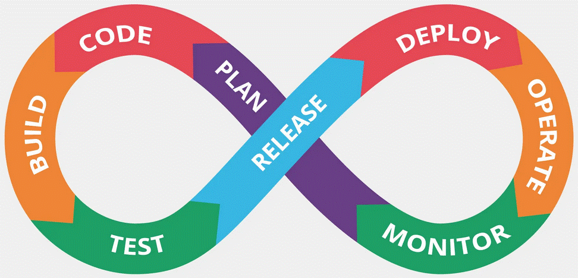

# **DevOps**

# Legend:

   * [Ansible](ansible/README.md)
   * [AWS](aws/README.md)
   * [Bash](bash/README.md)
   * [Cruptography](cruptography/README.md)
   * [Dev-Ops](devops/README.md)
   * [Docker](docker/README.md)
   * [Git](git/README.md)
   * [Jenkins](jenkins/README.md)
   * [Kubernetes](kubernetes/README.md)
   * [Linux](linux/README.md)
   * [Networking](networking/README.md)
   * [Python](python/README.md)
   * [Software & Tools](software&tools/README.md)
   * [Terraform](terraform/README.md)
   * [Terragrunt](terragrunt/README.md)
