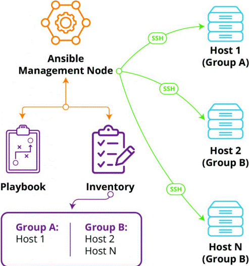

# **Ansible**

Ansible is a tool used for automating tasks like setting up servers, configuring software, and managing infrastructure.

example:

    ansible project:
    
[https://github.com/Issyanofsky/react-java0mysql](https://github.com/Issyanofsky/react-java0mysql)
  
    ansible exercise:

[https://github.com/Issyanofsky/react-java0mysql](https://github.com/Issyanofsky/ansible-class)

## Key Points:

  1. __Configuration Management:__ It helps automate the setup and management of servers (like installing software, updating settings, etc.).
  2. __Simple Syntax:__ Uses a simple language (YAML) to define tasks. These tasks are written in playbooks.
  3. __Agentless:__ You don’t need to install anything on the target servers. It uses SSH to communicate with them.
  4. __Idempotent:__ It ensures that running the same tasks multiple times won’t cause issues (i.e., the system will only change if needed).
  5. __Scalable:__ You can manage one server or thousands with the same tool.

__*__ on the free version - it doesnt have a Database.

__*IMPORTANT__ only work on Linux. Ansible must be deploy on a Linux base server.

## Good for:

  1. __Provision System:__ It sets up new machines or servers by installing the necessary software and configurations.
  2. __Configure System:__ It adjusts system settings, like network configurations or software settings, to match a desired state.
  3. __Deploy Apps:__ It installs and updates applications on servers.
  4. __Manage Systems and Apps:__ It ensures the systems and apps are running smoothly and as expected, fixing issues if needed.

__* NOTE__ Not good for installing operation systems.

# **Install Ansible Server**

https://www.ansiblepilot.com/articles/how-to-install-ansible-in-ubuntu-24.04-ansible-install/

## 1. Prerequisites

  * A Linux server for deploying Ansible.

## 2. Creating Key-pair

creating a key-pair for connecting  to the network mechine using SSH.
    
    Log into the server, and type:

          ssh-keygen -t rsa

## 3. Install Ansible

on the ansible server (log into it):

          sudo apt update
          sudo apt upgrade
          sudo apt install ansible

Verify Installation:
    
          ansible --version
          ansible-playbook --version
          ansible-galaxy --version

__*IMPORTANT__ check that all versions are the same.

## **Setting Remote mechine (computers)**

Set the remote mechine to allow access to the Ansible (root privilage).

  1. __export public key__

     Allowing SSH connection using key-pair (avoiding passward).

           From within the Ansible server (repeat this for each remote mechine):

                 ssh-copy-id <ansible_user>@<mechine_name or IP>
     
  2. __Set root permission (on Ubuntu)__
     
      gives the user permission to run any command as any user (including root) without needing to enter a password when using sudo

           On each of the mechine (connect to each one), set root permission.
     
                sudo visudo

           roll down, under %sudo, Add the following line:

               <user> ALL=(ALL) NOPASSWD: ALL

 

 
   # structure
   

    

## Key files structure

  * __Inventory:__ This file lists all the servers (hosts) that Ansible will manage. It can be a simple text file where you list server names or IP addresses.
  * __Playbook:__ A playbook is a YAML file where you write instructions (plays) for Ansible to follow. It tells Ansible what tasks to run on the servers (like installing software, copying files, etc.).
  * __Roles (optional):__ for organizing tasks into reusable units.

  Example of file structure:

          ansible/
            ├── inventory/       # List of servers
            ├── playbooks/       # YAML playbook files
            └── roles/           # Optional, for organizing tasks

## Creating Ansible evironment

 initialize an Ansible configuration file with all options disabled.

       on the absible server:

           ansible-config init --disabled > ansible.cfg

__*Optionally__ 

    create a folder and create a ansible.cfg file manualy.

    Add the follwoing line to the ansible.cfg:

          [defaults]
          inventory=<location_of_the_inventory_file>

## Setting Inventory File

Simple text file where you list server names or IP addresses.

Add the mechine to manage in a list:

          nano inventory.ini

  add the mechine (including the Ansible), example:

          [remote-controler]
          ansible ansible_host=172.0.0.1 ansible_connection=local become=true
          
          [control-plane]
          cp ansible_host=192.168.1.70 ansible_become=true
          
          [workers]
          w0 ansible_host=192.168.1.71 ansible_become=true
          w1 ansible_host=192.168.1.72 ansible_become=true
          
          [k8s_cluster:children]
          control-plain
          workers

## Ansible playbook

__key structure:__

  * __hosts:__ Specifies the target machines or groups of machines (from the inventory) where tasks will be executed.
  * __Tasks:__ A list of actions (commands or modules) to be performed on the hosts. Each task typically uses a module, like installing a package or copying a file.
  * __Variables:__ Optional, but you can define variables that can be reused throughout the playbook.
  * __Handlers:__ Special tasks that only run when notified by other tasks (like restarting a service after a configuration change).
  * __Name:__ A human-readable description of the playbook, tasks, or handlers, used for clarity and documentation.
  * __tags:__ used to run specific parts of a playbook or limit the execution of tasks. This is helpful when you only want to run certain tasks instead of the entire playbook.
  * __become:__ used to execute tasks with escalated privileges (like sudo), allowing Ansible to run commands as a different user, typically as the root user.

    Example:

        ---
        - name: Example playbook
          hosts: webservers
          become: yes  # Use sudo to execute tasks as root
          vars:
            app_name: "myapp"
          
          tasks:
            - name: Install package
              apt:
                name: "{{ app_name }}"
                state: present
        
            - name: Start service
              service:
                name: "{{ app_name }}"
                state: started
        
          handlers:
            - name: Restart service
              service:
                name: "{{ app_name }}"
                state: restarted

## Condition

Control the flow of tasks, allowing them to run only when certain conditions are met.

condition types:

   * __when__ The when statement allows you to run a task only if a condition is true.

         - name: Install nginx
          apt:
            name: nginx
            state: present
          when: nginx_installed.rc != 0  # Only run if nginx is not installed

    Boolean (True/False)
    
        - name: Install apache if apache_enabled is true
          apt:
            name: apache2
            state: present
          when: apache_enabled == true

   * __failed_when and changed_when__

     - __failed_when:__ This condition determines when a task is considered failed based on its result.
     - __changed_when:__ This condition controls when a task is considered changed (i.e., when it has modified something).

            - name: Check if a file exists
              stat:
                path: /path/to/file
              register: file_status
              failed_when: file_status.stat.exists == False  # Fail if the file doesn't exist
    
            - name: Update config file
              copy:
                src: config.conf
                dest: /etc/config.conf
              changed_when: false  # Task is never marked as "changed", even if it updates the file

   * __until__ You can use until with conditions to retry tasks until a certain condition is met.
    
            - name: Wait for service to be up
              service:
                name: nginx
                state: started
              register: service_status
              until: service_status.state == 'started'
              retries: 5
              delay: 10  # Retry every 10 seconds

## Loop

Allow to run a task multiple times with different inputs. This is useful when you need to repeat the same task for a list of items, like installing several packages, managing users, or iterating over files.

Ansible provides different ways to loop through data, such as using __loop__, __with_items__, or __with_dict__, but the modern and recommended approach is to use loop.

    Example (Loop over list of items):

        ---
        - name: Install multiple packages
          hosts: all
          become: yes
          tasks:
            - name: Install packages
              apt:
                name: "{{ item }}"
                state: present
              loop:
                - nginx
                - curl
                - git

    
## Ansible Roles

A way to organize playbooks and tasks into reusable, logical units. A role contains tasks, variables, handlers, files, templates, and defaults in a structured directory format.

Roles make your playbooks more modular, readable, and reusable.

    __Role structure:__

    deviding the YAML file (extracting the task part to a ceperate file (in the root folder)
    
        my_playbook/
          ├── site.yml
          └── roles/
              └── nginx/
                  └── tasks/
                      └── main.yml

    Example:

        roles/nginx/tasks/main.yml

            ---
            - name: Install nginx
              apt:
                name: nginx
                state: present
            
            - name: Start nginx service
              service:
                name: nginx
                state: started
                enabled: yes
                
        site.yml

            ---
            - name: Deploy nginx on webservers
              hosts: webservers
              become: yes
              roles:
                - nginx

    Run playbook:

            ansible-playbook site.yml

## Ansible Galaxy

a community platform where you can share, discover, and reuse Ansible roles and collections. You can find pre-made roles for various tasks, like setting up databases, web servers, or monitoring tools.

You can install roles from Galaxy using the ansible-galaxy command.

    Example (contain 2 galaxy roles):

            ansible-galaxy role install geerlingguy.docker

            ansible-galaxy role install geerlgguy.pip

    create a YAML file:

            ---
              - hosts: ansible
                vars:
                  pip_install_packages:
                    - name: docker
                roles:
                  - geerlingguy.pip
                  - geerlingguy.docker

    Deploy:

            ansible-playbook site.yml
