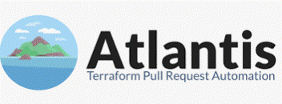

# **Atlantis**

A tool that helps automate the use of Terraform for managing infrastructure. 

https://www.runatlantis.io/

It makes working with Terraform easier in a team by:

  * __Automatically triggering Terraform plans__ when code changes are pushed to a Git repository (e.g., GitHub, GitLab).
  * __Running Terraform commands__ (like plan and apply) directly from the Git platform, without needing to manually run commands on your local machine or server.
  * Allowing __team collaboration__ by commenting on Git pull requests (PRs) to review Terraform plans and apply changes when ready.
