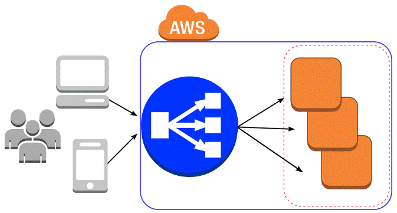

# **Load Balancer**

Load Balancer is a service that helps distribute incoming traffic (like website requests) across multiple servers (or instances) to ensure no single server gets overwhelmed. This helps to improve performance, availability, and reliability.

## Types of Load Balancers in AWS:

  * __Classic Load Balancer (CLB):__ (end of life) The original load balancer in AWS. It balances traffic based on simple rules.
  * __Application Load Balancer (ALB):__ A more advanced load balancer designed for HTTP/HTTPS traffic (layer 7). It can route traffic based on URL paths and hostnames.
  * __Network Load Balancer (NLB):__ A load balancer designed for TCP traffic at a much lower level (Layer 4). It can handle millions of requests per second with very low latency.
  * __Gateway Load Balancer (GLB):__ A specialized load balancer that handles traffic for third-party virtual appliances, like security tools, firewalls, and deep packet inspection devices.

# **Example- Create Classic Load Balancer (Cls)**

  * slower from all LoadBalancer types.
  * allow connection between EC2 Instances.
  * SSL offloading - terminating SSL/TLS encryption at the load balancer (arriving HTTPS passed as HTTP).

  * __IMPORTANT__ for HTTPS there is a need for providing a certificate.

Navigate to EC2 webpage --> (on the right side under Load Balancing) Load Balancer --> select "create Load Balancer" --> create (under Classic Load Balancer)

## Set the following settings:

   __facing__ choose as you need between: internet facing and internal setting.
   
   __VPC__ select network.
   
   __Availability Zones and subnets__ select Availability Zones for the Cls (can and its recomended to choose more then one Zone).
   
   __security Group__ setting the security group ( allow the traffic that should reach the LoadBalancer. e.g. HTTP, HTTPS).
   
   __Listeners__ set the protocol and port for the LoadBalancer to listen to (if using HTTS there a need for certificate).
   
   __helth check__ check web consistency (if change to TCP it will only check response - like ping).
   
   __Attributes__ enable both (enable cross-zone LoadBalancing and enable connection drin).

## Set LoadBalancer for forward

after deploying the LoadBalancer there a need to set the __Target__ for forwarding to.

    Navigate into the LoadBalancer (under EC2 page --> Load Balancings --> Load Blancers --> enter to the loadBalancer you created.

    Add the Instances (EC2) you wish the load Balancer to forward to.
    
