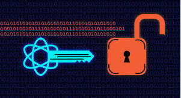

# **Cryptography**

## traceroute

  traceroute <site_Name> - traces the path (hops) that packets take from your machine to a target host (usually a domain or IP address).

  ## symetric encryption - private-key for both sides

  ## asymetric encription - 2 key's - one private and one public.

  ## encryipt types: 
    - RSA
    - DSA
    - AES
    - ECDSA

  ## cryptographic protocols:
    - ssl -  (Secure Sockets Layer) secure communication over a computer network, especially the internet. 
    - tls - (Transport Layer Security) more modern and secure version 

  ## creating certificate

    openssl req -x509 -newkey rsa:4096 - keyout server.key -out server.crt -days 365 -subj "/cn=example.com" -passout pass:

  ## file Location

    /etc/ssl/cert - public key location.

    /etc/ssl/private - private key location.

    /etc/apache2/site-available/default-ss.conf - location of certificate in apache.

    /usr/local/share/ca-certificates - certificates location for browser.
    
