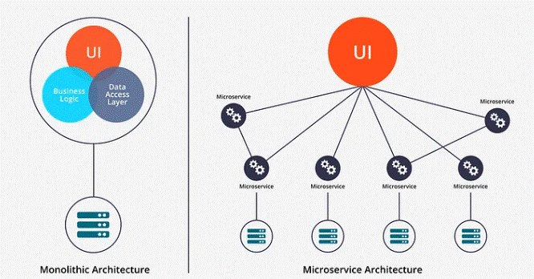

# **DevOps**

## software Architecture

|                  |              MicroService          |              Monolithic           |
|------------------|------------------------------------|-------------------------------------|
|                  | - independent workflow             | - easy to implement (not many parts)|
|                  | - fast to scale - easy upgrade.    | - minimum number of hops (all in one|         
|    Advantages    | - play and play                    |   long code).                       |
|                  | - Fault tolerance - stability.     | - DRY - simple deployment.          |
|                  | - increase Agility                 |                                     | 
|------------------|------------------------------------|-------------------------------------|
|                  | - complexity.                      | - spagetti code - long and complex  |
|                  | - operation Overheads - can have   |   code                              |
|  DisAdvantage    |   overlaping code.                 | - hard to trubelshoot and debug.    |
|                  | - hard to trubleshoot.             |                                     |  

## SOA (Service-Oriented Architecture) 

an architectural pattern in software design where software components, called "services," are designed to provide a specific business function or process and are loosely coupled with other services. SOA allows different applications to communicate with each other over a network (such as the internet) in a standardized way, often using web services.

  Advantages:

    - Reusability - spreading the services and reuse them in differante phases.
    - separation - each "service" does specific role. makes it more flexible.

  desAdvanteges:

    - side efect - one service can infuence others (like high traffic).
    - performance overhead - can overhead the system
    - complexity - one change can influance many other services.

## Event Vs. Message

  Event - represents something that has happened in the system or the environment. It is a notification or signal that some action or change has occurred, and it typically describes a state change or occurrence.

  massage -  A message is a more general term, often used to refer to a communication between different parts of a system or between different systems. A message can be either a request or a response and may or may not trigger a state change.

## Event-Driven Architecture (EDA)

   an architectural pattern in which software components, services, or systems communicate and interact primarily through events. It is designed to allow components to respond to events as they occur, enabling decoupled and highly scalable systems.

# Incident Management

  dealing with incident's:

    - Incident management - allocate the issue.
    - Ensures high availability - quick returning to wrok.

  Incident Life cycle:

    - Detection - detecting the issue.
    - Response - response to the issue (like giving backend to temporary overcome, retive old back-up and such).
    - Remediation - fixing the couse of the issue.
    - Resolution - verifying the issue is fix and working.
    - post-incident Review - reviewing the issue and fix to learn and avoid the issue in the future.

  security of Incidents:

    - P0 - critical - Immidiate response.
    - P1 - major incident - high priorety response.
    - P2 - minor incident - standard priority response.

# other

## alerting 

    setting alerting for issues that can occured.

## thresholds 

  refers to a limit or boundary that determines when a certain action should be taken or when a condition is met.

## KPI (Key Performance Indicator)

  the key metrics that are importent (can vary depends on the demands)

  

  
