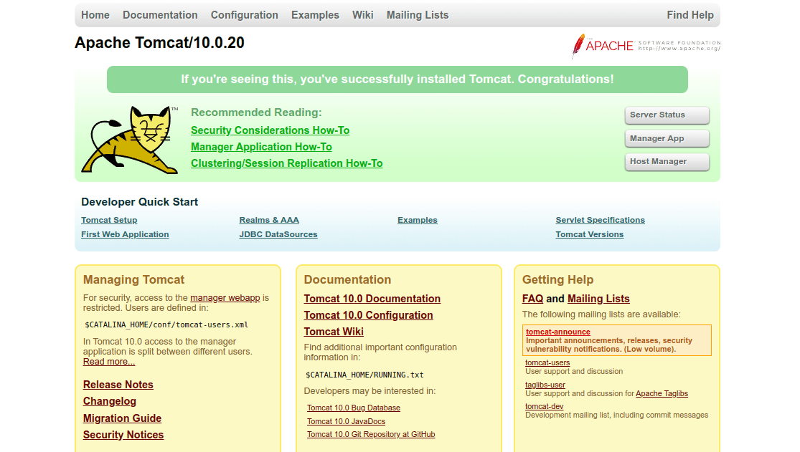

# **Jenkins**

open-source automation tool primarily used for continuous integration (CI) and continuous delivery (CD). It helps automate the process of building, testing, and deploying software, making it easier for developers to deliver high-quality software quickly and reliably.

## CI process:

    1. pulling code (Github or other).
    2. compile and building an image.
    3. testing - unit test/integration tests an more.
    4. packasging and prepering for deploy, like archive conteiner.

  

## **Installing Jenkins**

two ways to install jenkins:
        - plain installation using apt install.
        - hosted on apache (tomcat)

# install on tomcat

## install java

https://cloudinfrastructureservices.co.uk/how-to-install-apache-tomcat-server-on-ubuntu-22-04/

    Apache Tomcat is based on Java
    
        apt install openjdk-11-jdk

     verify the Java installation 
     
        java --version

## install Apache Tomcat

    create a dedicated user to run the Apache Tomcat server.

        useradd -m -U -d /opt/tomcat -s /bin/false tomcat

    download the latest version of Apache Tomcat from its official website 

        wget https://archive.apache.org/dist/tomcat/tomcat-10/v10.0.20/bin/apache-tomcat-10.0.20.tar.gz

    extract the downloaded file 

        tar -xvf apache-tomcat-10.0.20.tar.gz

    move the content of the extracted directory to the Apache Tomcat home directory.

        mv apache-tomcat-10.0.20/* /opt/tomcat

    change ownership of the Tomcat directory to tomcat.

        chown -R tomcat: /opt/tomcat
        
    set the execution permission on Tomcat binary file.     

       sh -c 'chmod +x /opt/tomcat/bin/*.sh'
    
    create a systemd service file to manage the Apache Tomcat service. 

        nano /etc/systemd/system/tomcat.service

Add the following configuration (to the tomcat.service file):

        [Unit]
        Description=Apache Tomcat
        After=network.target
        
        [Service]
        Type=forking
        
        User=tomcat
        Group=tomcat
        
        Environment=JAVA_HOME=/usr/lib/jvm/java-11-openjdk-amd64
        Environment=CATALINA_PID=/opt/tomcat/tomcat.pid
        Environment=CATALINA_HOME=/opt/tomcat
        Environment=CATALINA_BASE=/opt/tomcat
        Environment="CATALINA_OPTS=-Xms512M -Xmx1024M -server -XX:+UseParallelGC"
        
        ExecStart=/opt/tomcat/bin/startup.sh
        ExecStop=/opt/tomcat/bin/shutdown.sh
        
        ExecReload=/bin/kill $MAINPID
        RemainAfterExit=yes
        
        [Install]
        WantedBy=multi-user.target
        

reload the systemd daemon to apply the changes.

        systemctl daemon-reload

    start the Apache Tomcat service and enable it to start at system reboot with the following command.

        systemctl enable --now tomcat

    check the status of the Apache Tomcat service.

        systemctl status tomcat

    check the Apache Tomcat listening ports.

        ss -antpl | grep -i java

## Configure Apache Tomcat

    add an admin user and password to secure the Apache Tomcat.

        nano /opt/tomcat/conf/tomcat-users.xml

    Add the following lines above the line </tomcat-users>:

        <role rolename="admin-gui"/>
        <role rolename="manager-gui"/>
        <user username="admin" password="securepassword" roles="admin-gui,manager-gui"/>        

## Enable Apache Tomcat Remote Access

    By default, Apache Tomcat is accessed only from the localhost. To access the Apache Tomcat from the remote machine, you need to edit the context.xml file and remove the access restriction.

    edit the context.xml file.

        nano /opt/tomcat/webapps/manager/META-INF/context.xml

    Remove the following lines:

        <Valve className="org.apache.catalina.valves.RemoteAddrValve"
         allow="127\.\d+\.\d+\.\d+|::1|0:0:0:0:0:0:0:1" />
    
    To enable remote access for Tomcat Host Manager, edit the context.xml file.

        nano /opt/tomcat/webapps/host-manager/META-INF/context.xml

    Remove the following lines:

        <Valve className="org.apache.catalina.valves.RemoteAddrValve"
         allow="127\.\d+\.\d+\.\d+|::1|0:0:0:0:0:0:0:1" />

     restart the Tomcat service to implement the changes.

        systemctl restart tomcat         
        
## Access Apache Tomcat

    Access it using the URL http://your-server-ip:8080 on your web browser.

    Click on the Manager App. You will be asked to provide Tomcat admin username and password.

## Add Jenkins to Tomcat 

    download to the server the Jenkins war file

        wget https://get.jenkins.io/war-stable/2.492.1/jenkins.war

    on tomcat under Deploy --> content path --> the location of he jenkins.war file 

    (can copy the file directly to folder /opt/tomcat/webbapps)

    in the Tomcat page press on  Jenkins, enter password --> system plugin --> install
    
    
