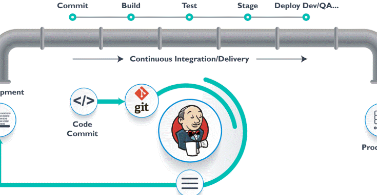

# **Jenkins**

open-source automation tool primarily used for continuous integration (CI) and continuous delivery (CD). It helps automate the process of building, testing, and deploying software, making it easier for developers to deliver high-quality software quickly and reliably.

## CI process:

    1. pulling code (Github or other).
    2. compile and building an image.
    3. testing - unit test/integration tests an more.
    4. packasging and prepering for deploy, like archive conteiner.

  

## **Installing Jenkins**

two ways to install jenkins:

        - plain installation using apt install.
        - hosted on apache (tomcat)

# install on tomcat

## install java

https://cloudinfrastructureservices.co.uk/how-to-install-apache-tomcat-server-on-ubuntu-22-04/

    Apache Tomcat is based on Java
    
        apt install openjdk-11-jdk

     verify the Java installation 
     
        java --version

## install Apache Tomcat

    create a dedicated user to run the Apache Tomcat server.

        useradd -m -U -d /opt/tomcat -s /bin/false tomcat

    download the latest version of Apache Tomcat from its official website 

        wget https://archive.apache.org/dist/tomcat/tomcat-10/v10.0.20/bin/apache-tomcat-10.0.20.tar.gz

    extract the downloaded file 

        tar -xvf apache-tomcat-10.0.20.tar.gz

    move the content of the extracted directory to the Apache Tomcat home directory.

        mv apache-tomcat-10.0.20/* /opt/tomcat

    change ownership of the Tomcat directory to tomcat.

        chown -R tomcat: /opt/tomcat
        
    set the execution permission on Tomcat binary file.     

       sh -c 'chmod +x /opt/tomcat/bin/*.sh'
    
    create a systemd service file to manage the Apache Tomcat service. 

        nano /etc/systemd/system/tomcat.service

Add the following configuration (to the tomcat.service file):

        [Unit]
        Description=Apache Tomcat
        After=network.target
        
        [Service]
        Type=forking
        
        User=tomcat
        Group=tomcat
        
        Environment=JAVA_HOME=/usr/lib/jvm/java-11-openjdk-amd64
        Environment=CATALINA_PID=/opt/tomcat/tomcat.pid
        Environment=CATALINA_HOME=/opt/tomcat
        Environment=CATALINA_BASE=/opt/tomcat
        Environment="CATALINA_OPTS=-Xms512M -Xmx1024M -server -XX:+UseParallelGC"
        
        ExecStart=/opt/tomcat/bin/startup.sh
        ExecStop=/opt/tomcat/bin/shutdown.sh
        
        ExecReload=/bin/kill $MAINPID
        RemainAfterExit=yes
        
        [Install]
        WantedBy=multi-user.target
        

reload the systemd daemon to apply the changes.

        systemctl daemon-reload

    start the Apache Tomcat service and enable it to start at system reboot with the following command.

        systemctl enable --now tomcat

    check the status of the Apache Tomcat service.

        systemctl status tomcat

    check the Apache Tomcat listening ports.

        ss -antpl | grep -i java

## Configure Apache Tomcat

    add an admin user and password to secure the Apache Tomcat.

        nano /opt/tomcat/conf/tomcat-users.xml

    Add the following lines above the line </tomcat-users>:

        <role rolename="admin-gui"/>
        <role rolename="manager-gui"/>
        <user username="admin" password="securepassword" roles="admin-gui,manager-gui"/>        

## Enable Apache Tomcat Remote Access

    By default, Apache Tomcat is accessed only from the localhost. To access the Apache Tomcat from the remote machine, you need to edit the context.xml file and remove the access restriction.

    edit the context.xml file.

        nano /opt/tomcat/webapps/manager/META-INF/context.xml

    Remove the following lines:

        <Valve className="org.apache.catalina.valves.RemoteAddrValve"
         allow="127\.\d+\.\d+\.\d+|::1|0:0:0:0:0:0:0:1" />
    
    To enable remote access for Tomcat Host Manager, edit the context.xml file.

        nano /opt/tomcat/webapps/host-manager/META-INF/context.xml

    Remove the following lines:

        <Valve className="org.apache.catalina.valves.RemoteAddrValve"
         allow="127\.\d+\.\d+\.\d+|::1|0:0:0:0:0:0:0:1" />

     restart the Tomcat service to implement the changes.

        systemctl restart tomcat         
        
## Access Apache Tomcat

    Access it using the URL http://your-server-ip:8080 on your web browser.

    Click on the Manager App. You will be asked to provide Tomcat admin username and password.

## Add Jenkins to Tomcat 

    download to the server the Jenkins war file

        wget https://get.jenkins.io/war-stable/2.492.1/jenkins.war

    on tomcat under Deploy --> content path --> the location of he jenkins.war file 

    (can copy the file directly to folder /opt/tomcat/webbapps)

    in the Tomcat page press on  Jenkins, enter password --> system plugin --> install
    
    

# **Pipeline**

two ways for creating Pipeline:

    * create Job for each step (job one for test and job 2 for build and so one), and after that creat a Pipeline for running those jobs in sequential way.
    * new feature - jenkins pieline project. this why depend on "Jenkinsfile".

file location:

    /opt/tomcat/.jenkins/workspace/pipeline1-maven/target

## Jenkins Pipeline Project

     define the entire deployment flow through code. using jenkinsfile.

## Jenkinsfile

        A Jenkinsfile is a text file that stores the entire workflow as code.

        written using the Groovy DSL and it can be created through a text/groovy editor or through the configuration page on the Jenkins instance.
        

## Pipeline concepts  

        defined collection in stage inside Jenkinsfile. defined all a process inside pipeline block like build, test, compile and deploy.

            pipeline {
            }
    
## Node

        A node is a machine that executes an entire workflow. 

            node{
            }

## Agent

        a machine or environment where the build or task runs. It can be the Jenkins server itself or another separate machine connected to Jenkins. The agent helps execute jobs or tasks defined in Jenkins pipelines.

## Any

        Runs the pipeline/ stage on any available agent.

## None

        this parameter is applied at the root of the pipeline and it indicates that there is no global agent for the entire pipeline and each stage must specify its own agent.

## Label

        Executes the pipeline/stage on the labeled agent.

## Docker

        This parameter uses docker container as an execution environment for the pipeline or a specific stage.

            pipeline{
                agent{
                    docker{
                        image 'Ubuntu'
                    }
                }
            }
        
## Stages

        used to organize and break down the steps of a pipeline. Each stage represents a specific phase of the process, like building, testing, or deploying. Stages help make the pipeline easier to understand and track by clearly               showing what part of the process is happening at any given time.

            pipeline{
                agent any stages {
                    stage {
                        steps {
                            ......
                        }
                    }
                }
            }

## Stage 
        
        steps is attribute dependent on Stages, here we cam defined new stage inside stages and what we need to do inside this block.

## steps

        steps is attribute dependent on Stage , we can defined series of steps inside one Stage , when we need execute stage will execute this steps in sequence, there must be at least one step within steps block.

## example of jenkinsfile

        pipeline {
        agent any  // Runs the pipeline on any available agent
    
        stages {
            stage('Build') {
                steps {
                    echo 'Building the project...'
                    // Add build commands here (e.g., compile, package)
                }
            }
            
            stage('Test') {
                steps {
                    echo 'Running tests...'
                    // Add test commands here (e.g., run unit tests)
                }
            }
    
            stage('Deploy') {
                steps {
                    echo 'Deploying the project...'
                    // Add deployment commands here (e.g., deploy to a server)
                }
            }
        }
    }

# **Jenkins Slave**

Setting up a Jenkins slave (also called a "Jenkins agent") is simple. 

 check if needed to open Port for the slave (on the master server)

     manage (on master server) --> security --> Fix (enter port).

# Prepare the Slave Machine

    * Ensure the machine you want to use as a slave has Java installed.
    * Make sure the machine is connected to the same network as the Jenkins master.

# Create a New Node in Jenkins

    * Go to your Jenkins dashboard.
    * Click on "Manage Jenkins" > "Manage Nodes and Clouds" > "New Node".
    * Choose "Permanent Agent", name it, and click OK.

# Configure the Node

    * set the Remote root directory: The directory where Jenkins will store files on the slave  (ex. /home/user/folder_Name).
    * ser Labels: (Optional) Tags to identify the node for specific jobs.
    * Usage: Choose whether Jenkins can use the slave for all jobs or only some jobs.
    * Launch method: Select the method to connect to the slave machine (e.g., via SSH, JNLP, etc.).
    
# Set Up the Slave on the Machine

    launch method:

        1. SSH - Make sure the slave machine allows SSH connections, and add the SSH credentials to Jenkins.
        or
        2. JNLP (Java Web Start):

                * Download the agent.jar from your Jenkins master (you’ll get this link on the node configuration page).
                * Run the agent using the command:
                
                        java -jar agent.jar -jnlpUrl http://<JenkinsMasterURL>/computer/<SlaveName>/slave-agent.jnlp

# Verify Connection

Check the "Node" page to see if the slave is online. You should see a "green" status.

# Use the Slave for Jobs

In the job configuration, you can now specify which node to run the job on, and Jenkins will use the slave.    

# **Create a Jenkins Slave in a Docker Container**

allow you to use a Docker container as a Jenkins agent (slave), running jobs inside the container.

https://devopscube.com/docker-containers-as-build-slaves-jenkins/

# Install Docker on the Slave Machine

    Make sure Docker is installed on the machine where you want to run the Jenkins slave container

# Log in to the server and open the docker service file

        sudo nano /lib/systemd/system/docker.service

    Search for ExecStart and add to that line with the following.

        -H tcp://0.0.0.0:4243

    Reload and restart docker service.

        sudo systemctl daemon-reload
        sudo service docker restart

    Validate API by executing the following curl commands

        curl http://localhost:4243/version
        curl http://< host IP>:4243/version

# check plugin

    in jenkins. plugin --> Docker --> plugin.

# create Docker cloud (in jenkins)

    manage --> new cloud

    * enter URI (tcp://192.168.1.9:4243)
    * enabled - set to True
    * under Docker Agent Template - enter the image we want to deploy:
        - image to deploy.
        - name of slave (Labels, Enabled - True).
        - set usage to run ony when deploy,
        - under connect method --> connect with SSH --> enter the ssh key
        - set "non verifying verification strategy"
    * fill Remote file system Root (/home/jenkins/agent)
    * pull once and update.

# cloud setting

Under Docker Cloud details:

    - Docker Host URL - set the portof the host (ex. tcp://192.168.1.8:4243).
    - Enable - set Ture.

# Docker Agent template

under Docker agent template:

    - Labels - profile name for the image (ex. jenkins-docker-slave).
    - Enabled - set True.
    - Name - can be same as Labels.
    - Docker Images - image name to download from DockerHub
    - Remote file system Root - location for files to work on (ex. /home/jenkins/agents).
    - Usage - Only Build jobs with label expression.....
    - connect method - Attach docker container.
    - pull strategy - pull once and update latest.

# Optional: Using Docker Inside the Jenkins Slave

If you want to run Docker commands inside the Jenkins slave container (i.e., Docker in Docker), you should mount the Docker socket (/var/run/docker.sock) into the container when you run it. This allows Jenkins to run Docker commands inside the slave container.

        docker run -d --name jenkins-slave \
          -e JENKINS_URL=http://<JenkinsMasterURL> \
          -e AGENT_NAME=jenkins-slave \
          -v /var/run/docker.sock:/var/run/docker.sock \
          jenkins-slave:latest \
          java -jar /usr/share/jenkins/agent.jar -jnlpUrl http://<JenkinsMasterURL>/computer/jenkins-slave/slave-agent.jnlp

# **Declerety Pipeline**

Declarative Pipeline is a way to define your Jenkins pipeline using a more structured and easier-to-read syntax compared to the scripted pipeline. It is a newer, more user-friendly style for writing Jenkins pipelines and provides built-in features like stages, steps, and post-actions.

createing a Declarative Pipeline in Jenkins:

# Go to Jenkins Dashboard

    Open Jenkins in your browser.

# Create a New Pipeline Job

    * Click on New Item.
    * Enter a name for your pipeline job.
    * Select Pipeline and click OK.

# Configure the Pipeline Script

    * Under the Pipeline section, choose Pipeline script.
    * In the Script field, you can define your pipeline using Declarative syntax.

    Basic Declarative Pipeline Example:

        pipeline {
            agent any  // This specifies that Jenkins can run the pipeline on any available agent
        
            stages {  // Define the stages for the pipeline
                stage('Build') {  // First stage of the pipeline
                    steps {
                        echo 'Building the project...'  // Step: print a message
                        // Add your build steps here (e.g., mvn, npm, etc.)
                    }
                }
        
                stage('Test') {  // Second stage
                    steps {
                        echo 'Running tests...'
                        // Add your testing commands here
                    }
                }
        
                stage('Deploy') {  // Third stage
                    steps {
                        echo 'Deploying the application...'
                        // Add your deployment commands here
                    }
                }
            }
        
            post {  // Actions to run after the pipeline execution
                success {
                    echo 'Pipeline succeeded!'
                }
                failure {
                    echo 'Pipeline failed!'
                }
            }
        }

# Save the Pipeline

    After adding the script, click Save.

# Run the Pipeline

    Go back to the job page and click Build Now to run the pipeline.    
    
