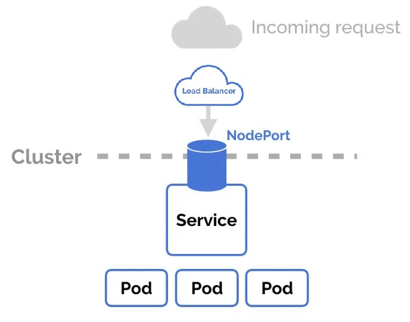

# **Ingress**

a tool that helps manage how outside traffic (like users on the internet) gets into your applications running inside a Kubernetes cluster.

on cloud we use LoadBalancer and Ingress:

* NOTE: by using Ingress the pods on the cluster should be ClusterIP or Host (No need for NodePort for internet access (set the cluster more secure)).

popular Ingress:

  * NGINX Ingress - fast and lightweight web server, to route traffic.
  * HAProxy Ingress - high-performance load balancer.

