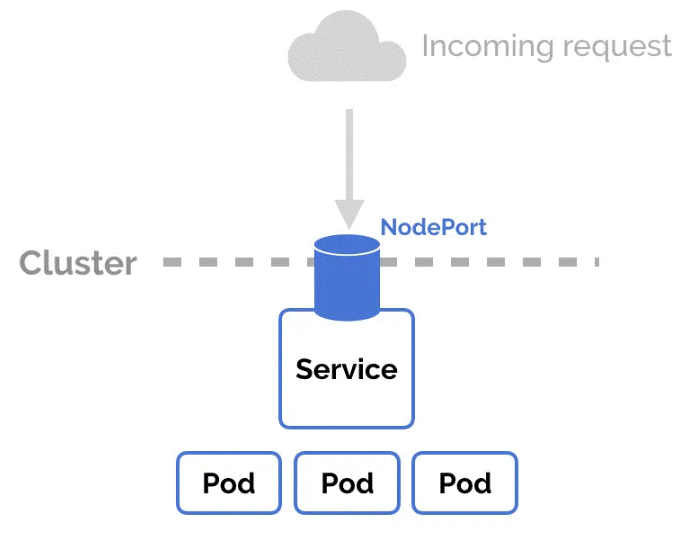

# **Ingress**

a tool that helps manage how outside traffic (like users on the internet) gets into your applications running inside a Kubernetes cluster.

on cloud we use LoadBalancer and Ingress:

