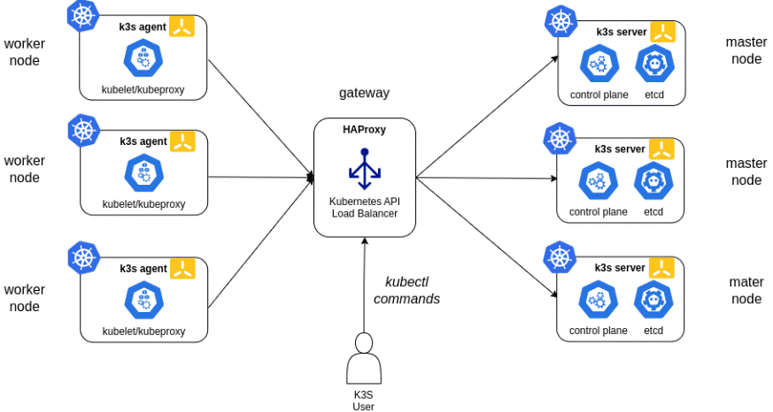

# **Kubernetes (K8s)**

# Legend:

   * [install Kubectl](#install-Kubectl)
   * [Labels](#Labels)
   * [Secrets](#Secrets)
   * [Dashboard](#Dashboard)
   * [Metrics Server](#Metrics-Server)
   * [Auto-scaling](#Auto-scaling)
   * [Kubectl Commands](#Kubectl-Commands)
   * [Services](#Services)
   * [Volumes](#Volumes)

## kubernetes install:

   * [minikube](files/MiniKube.md)
   * [Kubernetes (kubeadm)](files/kubernetes.md)

## Other install:

   * [NFS Server](files/NFS.md)
   * [MetalLB](files/metallb.md)
   * [Ingress](files/Ingress.md)
   * [Helm](files/helm.md)
   * [Istio (& kiali)](files/istio.md)
   * [OpenEBS (mayastor)](files/openEBS.md)
   * [CertBot (Certificate)](files/certbot.md)
     

Kubernetes is an open-source platform for automating the deployment, scaling, and management of containerized applications (like Docker containers).

Distribution of kubernetes:

  * on premice:

      - k3s - light kubernetes virsion.
      - minikube - one server for all (Control and worker plane).
      - kubespray - a distribution with plugins - fast deploy.
      - kubeadm - basic kubernetes installation

  * cloud Kubernetes:

      - GKE - google kubernetes.
      - AKS - Azure kubernetes services.
      - EKS - Amazon (also eks).
      - IBM - cloud container service.

 # cluster Architecture

  * Control plane:
       - API server - comunicating with the cluster (usualy port 8443). uses self certificate to secure communicating between nodes.
       - Scheduler - The Scheduler is responsible for deciding where the workloads (like Pods) should run inside the cluster.
       - Controller Manager - responsible for making sure that the current state of the cluster matches the desired state.
       - etcd -  key-value store that Kubernetes uses to store all its cluster data.

  * Worker nodes components:
       - kubelet -  is an agent that runs on each node in your Kubernetes cluster.
       - kube-proxy - a network proxy that runs on each node in the Kubernetes cluster.
       - Container Runtime - oftware responsible for running containers on the nodes.

## high Availability

Using more then one Control plain for high availability of the cluster. best practice setting odd number of servers (min 3 Control plane servers). 

* Importent: there is a need of a LoadBalancer for high availability and fault tolerance (must be installed primerly to the cluster). A Load Balancer is necessary to distribute incoming API requests evenly among the multiple Control Plane nodes and to ensure seamless operation in the following scenarios (HAProxy, Nginx, AWS (NLB,ALB)).

  # **install Kubectl**

(Kubernetes command-line tool)

check if already kubectl install, by:

   which kubectl

## Linux install

    Download the latest release:

      curl -LO "https://storage.googleapis.com/kubernetes-release/release/$(curl -s https://storage.googleapis.com/kubernetes-release/release/stable.txt)/bin/linux/amd64/kubectl"

   Make the kubectl binary executable:

     chmod +x ./kubectl

   Move the binary to a directory included in your PATH:

     sudo mv ./kubectl /usr/local/bin/kubectl

   Verify the installation:

     kubectl version --client

## Windows installation

   Download the latest Windows version of kubectl from:
     
      https://github.com/kubernetes/kubernetes/releases

   extract the content of the folder and set enviroment PATH to it.

     copy the kubectl.exe file to a folder.
     set his PATH in the enviroment.

# Connecting to Cluster

list all the contexts defined in your kubectl configuration file and the active one (with "*").

      kubectl config get-contexts

      kubectl config view - display info of the cluster we connected.

to connect the local computer to the cluster:

     copy from the Control plane the file, located:

     sudo cat ~/.kube/config

     paste the content to a new file (ex. k8sconfig), located in the local computer (ex. C:\Users\ec\.kube):

     export KUBECONFIG=~/.kube/k8config - set to the config file we created.

Verifiy:

    kubectl config get-contexts

    or any kubectl command:

    kubectl get nodes
     
     

   

# **Labels**

Adding Labels to nodes allow to give more flexibility in scheduking pods to host (ex. GPU-nodes).

Viewing Node Labels

      kubectl get nodes --show-labels
      
   Or for a specific node:

      kubectl describe node node-01

Adding or Modifying Node Labels

     kubectl label node node-01 disk=ssd
     
Update an existing label:

    kubectl label node node-01 env=production --overwrite

## Taints and Tolerations (Advanced Node Labeling)

Labels alone don’t restrict access—they just help with selection. To prevent pods from scheduling on certain nodes, you use taints, and pods need tolerations to bypass them.

Taint a node:

     kubectl taint nodes node-01 special=gpu:NoSchedule - prevents pods from scheduling on node-01 unless they tolerate special=gpu.

# **Secrets**

Secrets are Kubernetes objects designed to store and manage sensitive information, such as passwords, API keys, tokens, or certificates. They keep this data separate from your application code or pod definitions, improving security and flexibility.

Common Use Cases:

   * Database Credentials: Store username/password for a database.
   * API Tokens: Pass tokens to apps securely.
   * TLS Certificates: Use kubernetes.io/tls secrets for Ingress or apps needing HTTPS.
   * Registry Authentication: Pull images from private Docker registries.

## Creating a Secret

Using kubectl:

     kubectl create secret generic my-secret --from-literal=username=admin --from-literal=password=supersecret

Using a YAML File:

     apiVersion: v1
     kind: Secret
     metadata:
       name: my-secret
     type: Opaque
     data:
       username: YWRtaW4=  # base64 for "admin"
       password: c3VwZXJzZWNyZXQ=  # base64 for "supersecret"     

    * Note: The data field requires base64-encoded values. You can encode manually (echo -n "admin" | base64) or let kubectl handle it with --from-literal.

From Files:

    echo -n "admin" > username.txt
    echo -n "supersecret" > password.txt
    kubectl create secret generic my-secret --from-file=username.txt --from-file=password.txt

## Using Secrets in Pods

consumed by pods in two ways:

1. Environment Variables
  
       apiVersion: v1
       kind: Pod
       metadata:
         name: my-pod
       spec:
         containers:
         - name: my-app
           image: my-app:latest
           env:
           - name: USERNAME
             valueFrom:
               secretKeyRef:
                 name: my-secret
                 key: username
           - name: PASSWORD
             valueFrom:
               secretKeyRef:
                 name: my-secret
                 key: password

2. Mounted Files

       apiVersion: v1
       kind: Pod
       metadata:
         name: my-pod
       spec:
         containers:
         - name: my-app
           image: my-app:latest
           volumeMounts:
           - name: secret-volume
             mountPath: "/etc/secrets"
             readOnly: true
         volumes:
         - name: secret-volume
           secret:
             secretName: my-secret

## Managing Secrets

View Secrets:

     kubectl get secrets
     kubectl describe secret my-secret

Decode Secrets:

    kubectl get secret my-secret -o jsonpath='{.data.username}' | base64 -d

Edit Secrets:

    kubectl edit secret my-secret

Delete Secrets:

    kubectl delete secret my-secret

        

# **Dashboard**

Web-based interface that lets you manage and monitor your Kubernetes cluster (a system for running containerized apps) easily through a graphical UI instead of just using command lines.

* OpenLens - Other software for managing Clusters.

## installing Dashboard (using Helm)

      helm repo add kubernetes-dashboard https://kubernetes.github.io/dashboard/
      helm upgrade --install kubernetes-dashboard kubernetes-dashboard/kubernetes-dashboard --create-namespace --namespace kubernetes-dashboard
      

To uninstall using Helm:

     helm delete kubernetes-dashboard --namespace kubernetes-dashboard

## access and deploy Kubernetes Dashboard

Create the service account:

Create a file named dashboard-user.yaml with the following contents:

      apiVersion: v1
      kind: ServiceAccount
      metadata:
        name: dashboard-user
        namespace: kubernetes-dashboard

Apply the user:

     kubectl apply -f dashboard-adminuser.yaml

Create another file called dashboard-clusterrolebinding.yaml:

      apiVersion: rbac.authorization.k8s.io/v1
      kind: ClusterRoleBinding
      metadata:
        name: dashboard-user
      roleRef:
        apiGroup: rbac.authorization.k8s.io
        kind: ClusterRole
        name: cluster-admin
      subjects:
      - kind: ServiceAccount
        name: dashboard-user
        namespace: kubernetes-dashboard

Apply the clusterrolebinding:

      kubectl apply -f dashboard-clusterrolebinding.yaml

Retrieve the bearer token and copy the output for later use.

     kubectl get secret $(kubectl get serviceaccount dashboard-user -o jsonpath="{.secrets[0].name}") -o jsonpath="{.data.token}" | base64 --decode

## Start the dashboard

start the dashboard for testing on your local machine using the proxy command:

     kubectl proxy

## Access the Kubernetes Dashboard

(assuming that we have already established an SSH tunnel binding to the localhost port 8001 at both end).

     http://localhost:8001/api/v1/namespaces/kubernetes-dashboard/services/https:kubernetes-dashboard:/proxy/

     On the greeting page. choose Token enter the Bearer token you copied earlier.

# **Metrics Server**

## Basic Installation

Installation:

     kubectl apply -f https://github.com/kubernetes-sigs/metrics-server/releases/latest/download/components.yaml

* notice: i had to add this to te deploy to make it work:

    --kubelet-insecure-tls=true
  
Verify Installation:

    kubectl get pods -n kube-system | grep metrics-server
    kubectl get apiservices | grep metrics

Test Metrics Availability:

    kubectl top nodes
    kubectl top pods

# **Auto-scaling**

Auto-Scaling in Kubernetes:

    * Horizontal Pod Auto-Scaling (HPA): HPA automatically adjusts the number of pod replicas based on CPU utilization, memory usage, or custom metrics.
    * Vertical Pod Auto-Scaling (VPA): VPA focuses on optimizing resource allocation within individual pods.

* IMPORTANT - must install metric service in order to function.

## Horizontal Pod Auto-Scaling (HPA)

sets up the HPA for the Deployment:

      Create a Horizontal Pod Autoscaler (HPA) yaml file:

      apiVersion: autoscaling/v2beta2
      kind: HorizontalPodAutoscaler
      metadata:
        name: my-app-hpa
      spec:
        scaleTargetRef:
          apiVersion: apps/v1
          kind: Deployment
          name: my-app-deployment
        minReplicas: 2
        maxReplicas: 5
        metrics:
        - type: Resource
          resource:
            name: cpu
            targetAverageUtilization: 70

apply the YMAL file:

        kubectl apply -f hpa.yaml

## Vertical Pod Auto-Scaling (VPA)

dynamically adjusting CPU and memory allocations, VPA helps improve resource utilization and reduce wastage, ultimately leading to cost savings and improved performance.

Create a VPA configuration file (Yaml):

      apiVersion: autoscaling.k8s.io/v1
      kind: VerticalPodAutoscaler
      metadata:
        name: my-vpa
      spec:
        targetRef:
          apiVersion: "apps/v1"
          kind: Deployment
          name: my-deployment
        updatePolicy:
          updateMode: "Auto"      

Apply the VPA configuration to your Kubernetes cluster 

      kubectl apply -f vpa.yaml

Verify that the VPA is running and collecting data:

      kubectl describe vpa my-vpa

      

# **Kubectl Commands**

    * kubectl get nodes - display cluster nodes.
    * kubectl get pods -A - display all pods on cluster.
    * kubectl delete pod <pod_Name> - delete pod.
    * kubectl describe <pod_Name> - describe pod info.
    * kubectl logs <pod_Name> - display pods log.

## cluster commands

    * sudo systemctl status kublete - check basic k8s kublete status.
    * sudo system restart kubelete - way to refresh API connection.
    * kubectl describe configmap kubeadm-config -n kube-system - display Cluser info

 ## running pod using yaml

   apply pod:
    
       kubectl apply -f <file_Name.yaml>

  delete pod

      kubectl delete pod <pod_Name>

 ## kube exec

   execute command on a running pod.

      kubectl exec -it <pod_Name> --/bin/bash - open a bash on the running pod.

 ## kubectl run

   applying (runing) a pod coommand (without yaml file)

     kubectl run -i -tty --image=<image_name> --restart=never --sh

 ## Truble-shooting

pod dont terminate on delete (need to be run on all workers nodes):

      sudo apt purge --auto-remove apparmor
      

# **Services**

Service (srv) is a resource that defines how to access a set of Pods, and it can automatically balance traffic between them.

Types of Services:

     * ClusterIP - only accessible within the Kubernetes cluster.
     * NodePort - accessible from outside the cluster (range port 30000-32767).
     * LoadBalancer - uses an external load balancer to distribute traffic.

## display services

    kubectl get services -A - display all services in the cluster.

    kubectl get svc -n namespace - display services in a specific namespace.

## discribe

  kubectl describe svc <service_Name> - display descriptionn of the service setting.

## delete service

  kubectl delete -n <namespace>  svc <service_Name> - delete service name

## deploy service using command (not yaml)

  kubectl expose deploy <deploy_Name> --port 3000 --name <service_Name>

## deply service using YAML

  after creating a yaml file for creating a service:
  
      kubectl apply -f <yaml_file>

  example of yaml:

     apiVersion: v1
     kind: Service
     metadata:
       name: myapp-service
     spec:
       selector:
         app: myapp  # Selects Pods with this label
       ports:
         - protocol: TCP
           port: 80
           targetPort: 80
       type: NodePort  # Exposes the service outside the cluster

# **Volumes**

service for dealing with storage for pod cluster.

storage class (sc) - is like a "template" that tells Kubernetes how to automatically create storage (like a cloud disk or network drive) when you ask for it. It defines things like the type of storage (e.g., fast SSD or cheap hard drive) and where it comes from (e.g., AWS, Google Cloud, etc.).

      kubectl get storageclass

   example:

      apiVersion: storage.k8s.io/v1
      kind: StorageClass
      metadata:
        name: my-storage-class
      provisioner: kubernetes.io/aws-ebs  # This says "use AWS EBS storage"
      parameters:
        type: gp2  # This is a general-purpose SSD in AWS
      reclaimPolicy: Retain  # Keeps the storage after the PVC is deleted (optional)
      
Persistent Volume (PV): This is the actual storage space (like a disk) that Kubernetes can use.

      kubectl get pv 

  example:

      apiVersion: v1
      kind: PersistentVolume
      metadata:
        name: my-pv
      spec:
        capacity:
          storage: 5Gi  # Size of the storage (5 gigabytes)
        accessModes:
          - ReadWriteOnce  # Can be used by one pod at a time
        persistentVolumeReclaimPolicy: Retain  # Keeps the PV after use
        storageClassName: my-storage-class  # Links to the StorageClass (optional)
        hostPath:
          path: "/mnt/data"  # Uses a folder on the local machine (for testing)    
          
Persistent Volume Claim (PVC): This is your request for storage.

      kubectl get pvc

  example:

      apiVersion: v1
      kind: PersistentVolumeClaim
      metadata:
        name: my-pvc
      spec:
        accessModes:
          - ReadWriteOnce  # Matches the PV’s access mode
        resources:
          requests:
            storage: 5Gi  # Asks for 5 gigabytes
        storageClassName: my-storage-class  # Links to the StorageClass (optional)
        
