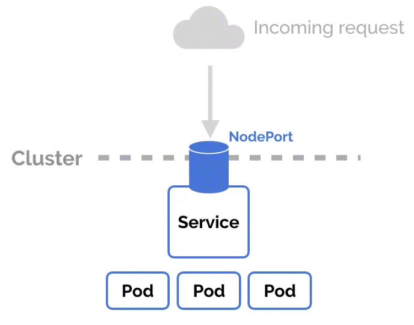
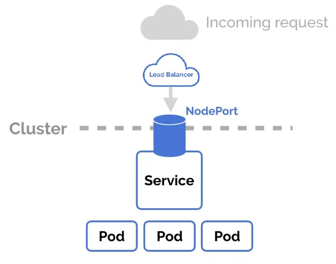

# **Ingress**

a tool that helps manage how outside traffic (like users on the internet) gets into your applications running inside a Kubernetes cluster.

on cloud we use LoadBalancer and Ingress:

* NOTE: by using Ingress the pods on the cluster should be ClusterIP or Host (No need for NodePort for internet access (set the cluster more secure)).

popular Ingress:

  * NGINX Ingress - fast and lightweight web server, to route traffic.
  * HAProxy Ingress - high-performance load balancer.

# **Install Ingress (Nginx)**

Explanations:

     https://github.com/kubernetes/ingress-nginx/tree/main

installing Guide: 

    https://kubernetes.github.io/ingress-nginx/deploy/

download the correct yaml file (depends on the installed system - for server installation i choose Bare-Metal)

   https://raw.githubusercontent.com/kubernetes/ingress-nginx/controller-v1.12.0/deploy/static/provider/baremetal/deploy.yaml

edit the file that was download:

   under "service" --> change the "type: NodePort" to "type: LoadBalancer"

   kubectl apply -f <yaml_file_just_edited>

Verify:

   kubectl get svc -n ingress-nginx

 ## example for ingress Rule

add to deploy this on deploying the service needed the Ingress (not on installation).

    apiVersion: networking.k8s.io/v1
    kind: Ingress
    metadata:
      name: example-ingress
      namespace: default
      annotations:
        nginx.ingress.kubernetes.io/rewrite-target: /$2
    spec:
      ingressClassName: nginx
      rules:
      - host: example.com
        http:
          paths:
          - path: /api(/|$)(.*)
            pathType: Prefix
            backend:
              service:
                name: api-service
                port:
                  number: 80
          - path: /web(/|$)(.*)
            pathType: Prefix
            backend:
              service:
                name: web-service
                port:
                  number: 80
      tls:
      - hosts:
        - example.com
        secretName: example-tls-secret
            
  
