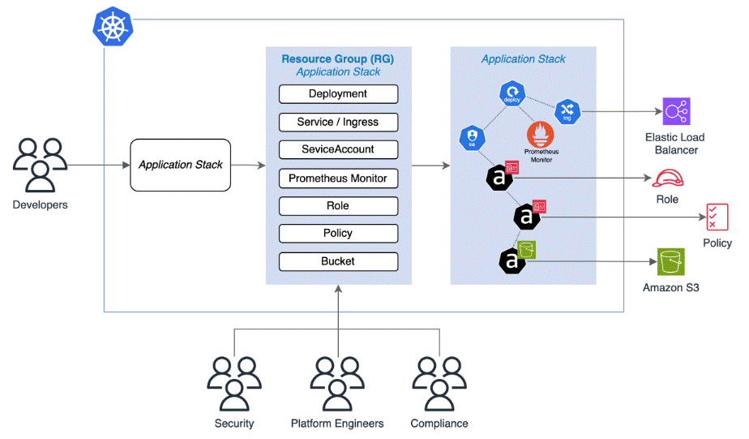

# **Kro (Kubernetes Resource Orchestrator)**

A Kubernetes Resource Orchestrator is a tool that manages and organizes the resources (like containers, networks, and storage) used by applications in a Kubernetes cluster. 

Kubernetes Resource Orchestrator (like the default Kubernetes control plane) manages and automates the deployment, scaling, and operation of containerized applications across a cluster. It ensures that your apps are always running as desired.

It helps to automate tasks like:

  * __Deploying__ applications.
  * __Scaling__ them up or down.
  * __Managing__ their availability and health.

Kro installs a Custom Resource Definition (CRD) called ResourceGraphDefinition (RG). The Platform, Security, and Compliance teams can collaborate to create custom APIs by defining Custom Resources for the ResourceGraphDefinition CRD.

https://kro.run/docs/overview

## Install kro using Helm

Fetch the latest release version from GitHub

      export KRO_VERSION=$(curl -sL \
          https://api.github.com/repos/kro-run/kro/releases/latest | \
          jq -r '.tag_name | ltrimstr("v")'
        )

Validate KRO_VERSION populated with a version
      
      echo $KRO_VERSION

Install kro using Helm     

      helm install kro oci://ghcr.io/kro-run/kro/kro \
        --namespace kro \
        --create-namespace \
        --version=${KRO_VERSION}

## Verifying the Installation

Check the Helm release:

      helm -n kro list

Check the kro pods:

      kubectl get pods -n kro
