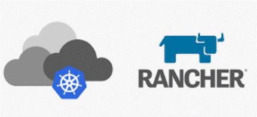

# **Rancher**

Rancher is a platform used to manage and deploy Kubernetes clusters. makes it easier to set up, manage, and scale Kubernetes clusters across different environments (like on-premises, in the cloud, or hybrid).

## Installing Rancher

This deployment is of single rancher node installation. it deployed in a Docker Container.

### Prerequisites:

 A server to deploy the Container. this guide is on a AWS Instance.

on the AWS consol. 

Deploy a EC2 Instance with the following setting:
         
          type: t2.midium
          key-pair (for SSH connecting)
          allow SSH (apply all)
          Ubuntu (not AWS Linux)

set IAM Role

          gave the EC2 permissions to other mechine.
          
set Elastic IP for the EC2 

      on the Elastic IP assosiate it to the EC2 - under actions --> assosiate Elastic IP address
      (its free as long the EC2 is on)

### Connecting to the EC2

      ssh -i <certificate_name> ubuntu@<EC2_IP>

### Installing Docker

      sudo apt update
      curl -fsSL https://get.docker.com -o get-docker.sh
      sudo sh get-docker.sh

give user permission

      sudo usermod -aG docker <user> 
      (sudo usermod -aG docker ubuntu)

Verify:

log-off and log-on again to the server

      ssh -i <certificate_name> ubuntu@<EC2_IP>

type
      docker info

### Run Rancher

      docker run -d --restart=unless-stopped -p 80:80 -p 443:443 --privileged rancher/rancher

__*__ there is no need to set volume. the container has its own volume set.
