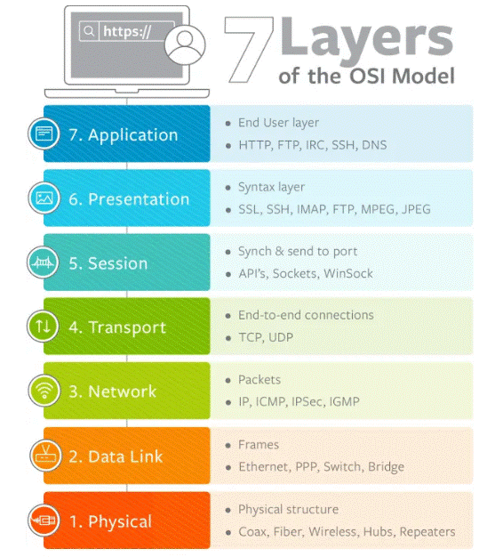

# **Networking**

# 7 Layer module

## upper layers: Application, Presentation, Session.

## lower layers: Transport, Network, Data Link, Physical.

## Protocol 

  Protocol - like a language or set of instructions that devices follow to communicate.

## TCP / UDP (operate at the Transport Layer )

  UDP - a connectionless protocol, meaning there is no need to establish a connection before sending data. It sends data packets without guaranteeing delivery, order, or error checking.

  TCP - a connection-oriented protocol, meaning that before data can be sent, a connection must be established between the sender and the receiver. It ensures reliable data transfer and guarantees that data packets will arrive in the correct order.
  
# Network Class

  Network Class - refers to a way of categorizing IP addresses based on their range. The classification helps determine how an IP address is used in terms of the size of the network and the number of devices it can accommodate.

  There are five main classes of IP addresses (A, B, C, D, and E), but most networks use only Classes A, B, and C:

    - Class A: Large networks, many hosts.
    - Class B: Medium-sized networks, fewer hosts.
    - Class C: Small networks, few hosts.
    - Class D: Multicast addresses (group communication).
    - Class E: Reserved for future use.

|    class    |     IP (example)   |   network-part     |    host-part     |   number_hosts   |   subnet      |
|-------------|--------------------|--------------------|------------------|------------------|---------------|
| class A     | 1.2.3.4            | 1                  | .2.3.4           | 16,777,214       | 255.0.0.0     |
| class B     | 129.2.3.4          | 129.2              | .3.4             | 65,534           | 255.255.0.0   |
| class C     | 130.2.3.4          | 130.2.3            | .4               | 254              | 255.255.255.0 |

## CIDR  (Classless Inter-Domain Routing)

  CIDR - compact way of representing IP addresses and their associated subnet masks.

  IP_address/Prefix_length

  (192.168.1.0/24)

## first and Last Ip are reserved. 
  firts to the network and the last for Broadcusts.

  example of a 4 ip address network - 172.16.200.0/30:

    Network: 172.16.200.0
    
    firts-IP: 172.16.200.1
    
    last-IP: 172.16.200.2
    
    Broadcust: 172.16.200.3

## Public & Private Address

  IANA (Internet Assigned Numbers Authority) is an organization responsible for managing and coordinating the global domain name system (DNS), IP address allocation, and other critical aspects of the Internet's infrastructure.
  
  Private Network: address ranges reserved for private use.

## NAT (Network Address Translation)

  NAT - allow multiple devices within the network to share a single public IP address when accessing the internet. 

## Subnet Table

|   subnet  |   1    |    2   |    4   |    8   |   16  |   32  |   64  |  128  |  256  |

|   Host    |   256  |  128   |   64   |   32   |   16  |   8   |   4   |   2   |   1   |

|subnet mask|  /24   |  /25   |   /26  |   /27  |  /28  |  /29  |  /30  |  /31  |  /32  | 

