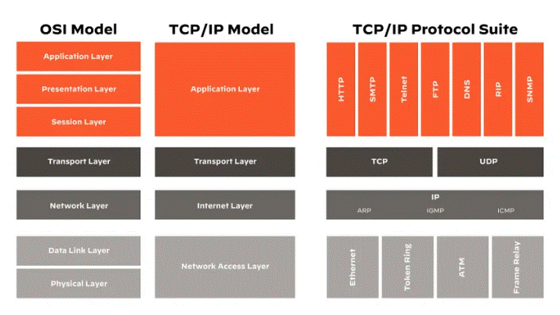
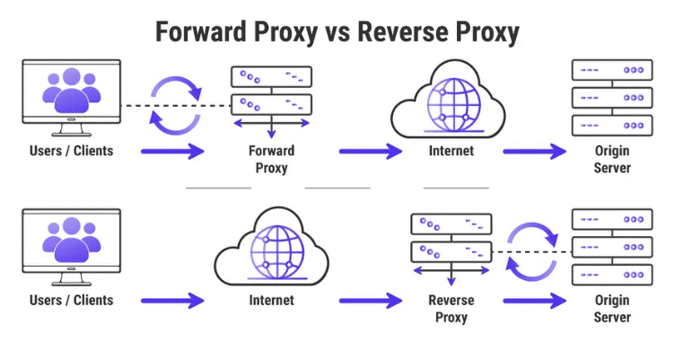

# **Networking**

# 7 Layer module

## upper layers: Application, Presentation, Session.

## lower layers: Transport, Network, Data Link, Physical.

## Protocol 

  Protocol - like a language or set of instructions that devices follow to communicate.

## TCP / UDP (operate at the Transport Layer )

  UDP - a connectionless protocol, meaning there is no need to establish a connection before sending data. It sends data packets without guaranteeing delivery, order, or error checking.

  TCP - a connection-oriented protocol, meaning that before data can be sent, a connection must be established between the sender and the receiver. It ensures reliable data transfer and guarantees that data packets will arrive in the correct order.
  
# Network Class

  Network Class - refers to a way of categorizing IP addresses based on their range. The classification helps determine how an IP address is used in terms of the size of the network and the number of devices it can accommodate.

  There are five main classes of IP addresses (A, B, C, D, and E), but most networks use only Classes A, B, and C:

    - Class A: Large networks, many hosts.
    - Class B: Medium-sized networks, fewer hosts.
    - Class C: Small networks, few hosts.
    - Class D: Multicast addresses (group communication).
    - Class E: Reserved for future use.

|    class    |     IP (example)   |   network-part     |    host-part     |   number_hosts   |   subnet      |
|-------------|--------------------|--------------------|------------------|------------------|---------------|
| class A     | 1.2.3.4            | 1                  | .2.3.4           | 16,777,214       | 255.0.0.0     |
| class B     | 129.2.3.4          | 129.2              | .3.4             | 65,534           | 255.255.0.0   |
| class C     | 130.2.3.4          | 130.2.3            | .4               | 254              | 255.255.255.0 |

## CIDR  (Classless Inter-Domain Routing)

  CIDR - compact way of representing IP addresses and their associated subnet masks.

  IP_address/Prefix_length

  (192.168.1.0/24)

## first and Last Ip are reserved. 
  firts to the network and the last for Broadcusts.

  example of a 4 ip address network - 172.16.200.0/30:

    Network: 172.16.200.0
    
    firts-IP: 172.16.200.1
    
    last-IP: 172.16.200.2
    
    Broadcust: 172.16.200.3

## Public & Private Address

  IANA (Internet Assigned Numbers Authority) is an organization responsible for managing and coordinating the global domain name system (DNS), IP address allocation, and other critical aspects of the Internet's infrastructure.
  
  Private Network: address ranges reserved for private use.

## NAT (Network Address Translation)

  NAT - allow multiple devices within the network to share a single public IP address when accessing the internet. 

## Subnet Table

  |   subnet  |   1    |    2   |    4   |    8   |   16  |   32  |   64  |  128  |  256  |
  |-----------|--------|--------|--------|--------|-------|-------|-------|-------|-------|
  |   Host    |   256  |  128   |   64   |   32   |   16  |   8   |   4   |   2   |   1   |
  |subnet mask|  /24   |  /25   |   /26  |   /27  |  /28  |  /29  |  /30  |  /31  |  /32  | 

# Switch

   Data Link leyer, can split networks to VLAN's allowing seperate networks to run each with it security settings, routing and such.

# DHCP

  DHCP (Dynamic Host Configuration Protocol) - is a network protocol used to automatically assign IP addresses and other network configuration settings to devices (such as computers, printers, and smartphones) on a network. 

# ACL (Access Control List)

  ACL - set of rules or policies that define what traffic is allowed or denied to flow through a network device (such as a router or firewall).  It is used to filter traffic based on various criteria, such as IP addresses, protocol types, ports, and more.

  ## ACL type:

    1. file system (ACL) - filters for allow/deny permssions for files and directories.
    2. Network (ACL) - Network traffic filtering (deny/allow).

    traffic can:

    - Ingress - traffic entering.
    - egress - traffic OUTgoing.

  # Proxy

    proxy - an intermediary server or service that sits between a client (e.g., a user’s computer or device) and a destination server (e.g., a website or online service) on the internet.
    

# HTTP (HyperText Transfer Protocol)

  HTTP - sending and receiving data on the web. It's the protocol (or set of rules) that web browsers and servers use to communicate (good fo web-pages and API).

  

  * use TCP

  HTTP Request (Client -> Server): request made by the client to the server to get some information.
  
    - Method: What kind of action you want to perform (e.g., GET, POST, etc.).
    - URL: The address of the resource (like www.example.com).
    - Headers: Extra information (like the browser version, accepted formats, etc.).
    - Body: The data being sent (for example, if you're submitting a form).

  HTTP Response (Server -> Client): response sent by server to the client.

    - Status Code: A number indicating if the request was successful (e.g., 200 means "OK", 404 means "Not Found").
    - Headers: Information about the server and the data being sent (like the content type, length, etc.).
    - Body: The actual content being returned (e.g., the HTML of a webpage).

  common concepts:

    - URL (Uniform Resource Locator) -  web address you enter in a browser to access a specific resource on the web (e.g., https://www.example.com).
    - VERSION - The version refers to the version of the HTTP protocol being used, such as HTTP/1.1 or HTTP/2. It tells the server how to handle the request/response.
    - STATUS - numbers sent by the server to indicate the result of the request (200 OK, 404 Not Found).
    - BODY - The body of an HTTP request or response contains the data being sent to or received from the server.
    - HEADER - contain meta-information about the request or response (such as content type, length, authentication tokens, etc.).
    - Query String - the part of a URL that comes after the ? and contains parameters (in https://example.com/search?q=python, the query string is q=python, which is used to send data to the server).
    - POST - POST is an HTTP method used to send data to the server (like submitting a form or uploading a file).
    - GET - GET is an HTTP method used to retrieve data from the server (e.g., requesting a web page).
    - PUT -  an HTTP method used to update an existing resource on the server with new data.
    - PATCH - an HTTP method used to partially update a resource, meaning you send only the data that needs to be changed, not the whole resource.
    - DELETE - an HTTP method used to remove a resource from the server (e.g., deleting a post or an item).
    - HEAD -  an HTTP method similar to GET but only retrieves the headers (not the body) of the response.
    - OPTIONS - an HTTP method used to request information about the available methods or features of a server (like asking, "What can I do with this resource?").
  
  ## web service technology (mostly for API):

    - XML-RPC - A protocol that uses XML to encode its data and HTTP as a transport method.
    - SOAP (Simple Object Access Protocol) - A protocol that uses XML messages to request and send data over the web.
    - JSON-RPC - A protocol that uses JSON (instead of XML) to encode data for remote procedure calls (RPC).
    - REST (Representational State Transfer) - An architectural style for building APIs that uses standard HTTP methods (GET, POST, PUT, DELETE).
    - GraphQL - A query language for APIs that allows clients to request specific data from a server.

    
