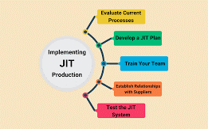

# **Quality Tools**

Tools used to enhance software quality, security, and performance across various stages of the development lifecycle. 

Software & Tools

# **Sonarqube**

SonarQube is an open-source platform for continuous inspection of code quality. It performs static code analysis to find bugs, vulnerabilities, and code smells (parts of the code that might be problematic in the future). It supports multiple programming languages like Java, C#, JavaScript, Python, and more.

__Use cases:__

  * __Improving Code Quality:__ It automatically analyzes your codebase to identify potential issues, like bugs or inefficiencies, so developers can fix them before they become bigger problems.
  * __Security Monitoring:__ It can detect vulnerabilities in the code to prevent future security issues.
  * __CI/CD Integration:__ SonarQube integrates easily into Continuous Integration/Continuous Deployment (CI/CD) pipelines (GitHub, Jenkins), running checks each time code is pushed to a repository, ensuring continuous improvement.

Has 2 versions:

  * __local__ installation.
  * __SAAS__ - cloud use - https://sonarcloud.io

# **Jit**

JIT is a method of running code where a program is compiled into machine code only when it's needed, rather than being pre-compiled. This helps optimize performance by allowing the system to compile the most relevant code during runtime, making the program faster over time.

__Use cases:__

  * __Optimizing Performance:__ JIT compilation is used to speed up the execution of programs by compiling code on-the-fly based on what the program needs at that moment.
  * __Dynamic Languages:__ It is commonly used in languages like Java and JavaScript, where parts of the code are compiled as they are executed, making them more efficient for different use cases.
  * __Web Applications:__ Many modern web frameworks, such as those running JavaScript (V8 engine in Chrome) or Java (JVM), use JIT compilation to improve performance as the code runs.

__*__ 
  
  * work with GitHub.
  * good for checking API.

__* IMPORTANT__ best practice is not using it on production (only on test environments)

# **Snyk**

Snyk is a developer-first security tool that finds and fixes vulnerabilities in open-source dependencies (the libraries and packages your code relies on). It can also monitor containers, Kubernetes, and infrastructure as code for security issues.

__security oriented__ 

__Use cases:__

  * __Dependency Scanning:__ When developers use open-source libraries, Snyk scans them for known security vulnerabilities (like Heartbleed or Log4j) and notifies them if their project is exposed.
  * __Container Security:__ Snyk can scan Docker images or Kubernetes clusters to identify security risks in your containers.
  * __Automated Fixes:__ It suggests or even automatically creates pull requests to fix the identified vulnerabilities in dependencies.
  * __CI/CD Integration:__ It can integrate with your CI/CD pipelines to automatically check for vulnerabilities whenever new code is pushed or dependencies are added.

# **Trusted Advisor (AWS)**

AWS Trusted Advisor is an AWS service that offers real-time best practice recommendations to help optimize your AWS environment. It checks for security, cost optimization, fault tolerance, and performance.

__Use cases:__

  * __Cost Optimization:__ It can recommend ways to reduce your AWS costs by suggesting unused or underused resources, such as EC2 instances or S3 storage.
  * __Security Best Practices:__ Trusted Advisor checks for weak security settings (like open security groups or missing MFA on your AWS root account).
  * __Performance Improvements:__ It can suggest how to optimize the performance of your AWS resources, such as recommending right-sizing of EC2 instances.
  * __Compliance and Risk Management:__ It helps to ensure that your AWS environment is aligned with best practices, helping you meet compliance requirements.

# **CloudTrail (AWS)**

AWS CloudTrail is a service that enables governance, compliance, and operational and risk auditing of your AWS account. It records and logs all the actions taken by users, services, or applications in your AWS environment.

__good For__ checking logs for knowing how did (and when) changes.

__Use cases:__

  * __Auditing and Compliance:__ CloudTrail logs every action, such as who launched an EC2 instance, changed a security group, or accessed an S3 bucket. This data is critical for audits and compliance reporting.
  * __Security Monitoring:__ You can use CloudTrail logs to track unauthorized access or suspicious activity, like a user trying to access restricted resources.
  * __Operational Troubleshooting:__ If something breaks in your AWS environment, CloudTrail provides detailed logs of events that happened leading up to the issue, helping you trace the root cause.

# **CloudWatch (AWS)**

AWS CloudWatch is a monitoring service for AWS cloud resources and applications. It collects data from logs, metrics, and events and provides insights into the health and performance of your AWS resources.

__Use cases:__

  * __Monitoring AWS Resources:__ CloudWatch tracks the performance of AWS services like EC2, RDS, Lambda, and more, giving you metrics such as CPU usage, disk activity, and network traffic.
  * __Log Management:__ CloudWatch can aggregate logs from AWS resources (like EC2 instances or Lambda functions) and provide insights into system health or application behavior.
  * __Alerts and Automation:__ You can set up alarms for specific thresholds (e.g., when CPU usage exceeds 80%) and automate actions, such as scaling resources or sending notifications.
  * __Anomaly Detection:__ It can help detect unusual patterns in metrics and logs, such as sudden increases in traffic or spikes in errors, helping you quickly respond to issues.
