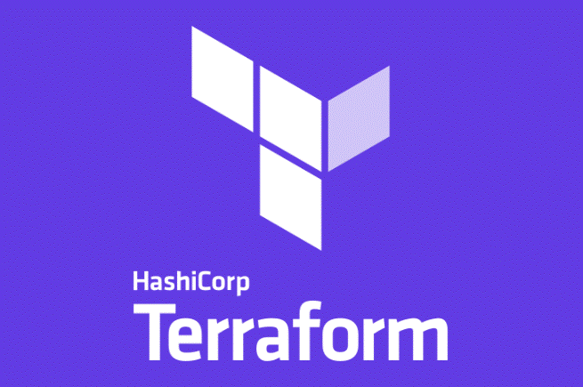

# **TerraForm**

For more Terraform examples. visit: https://github.com/Issyanofsky/terraform-class

A tool that helps you automate and manage your cloud infrastructure in a simple and consistent way.

Instead of manually creating and configuring cloud resources (like servers, databases, and networks), you write code to describe the infrastructure you need. Terraform then automatically creates and manages those resources for you.

Terraform File use extention: __.tf__

# Instal Terraform (windows)

## 1. create a folder

 On the computer create a folder for placing the Terraform EXE file (e.g. c:\terraform).

## 2. Downlowd Terraform

Download the suited file from:

      https://developer.hashicorp.com/terraform/install

## 3. Copy content

Copy the content from the Download to the folder we just created (step 1).

## 4. Environment Setting

Add the PATH (the folder we created) to the Environment setting. so it will be accessable from all path.

## **Providers**

  * Terraform interacts with cloud platforms and services through providers. Providers are plugins that allow Terraform to communicate with services like AWS, Google Cloud, Azure, etc.
  * Each provider has a set of resources (like EC2 instances, S3 buckets, etc.) that you can manage with Terraform.

  This example establish connection to AWS cloud:
  
      provider "aws" {
        region = "us-east-1"
        access_key = "....."
        secret_key = "....."
      }

## **Resources**

Resources represent the actual cloud components you're creating or managing. For example, an EC2 instance on AWS, a storage bucket on Google Cloud, or a database on Azure.

Example for creating an EC2 instance:

      resource "aws_instance" "example" {
        ami           = "ami-0c55b159cbfafe1f0"  # Example AMI ID
        instance_type = "t2.micro"
      }

__* NOTICE__ the workflow (file .tf) contin the Providers and Resources. the correct file should be:

      provider "aws" {
        region = "us-east-1"
        access_key = "....."
        secret_key = "....."
      }

      resource "aws_instance" "example" {
        ami           = "ami-0c55b159cbfafe1f0"  # Example AMI ID
        instance_type = "t2.micro"
      }

## **Deploying Terraform**

Creating a folder with the terraform .tf file. 

Navigate using Gitbash (Powershell) to the folder

## Init

Initilize the folder. create and download the nessery files needed for deploying the Terraform script.

     type in GitBash:
   
        terraform init

__*__ done once (or in case there a change in the structure - like modules inside)

__--reconfigure (flag):__

Done when changes to the provider configuration or module sources that Terraform needs to pick up.

Or

If you want to reset or refresh your environment without deleting the .terraform directory manually.

     type in GitBash:
   
        terraform init --reconfigure

## Plan

shows you what changes Terraform will make to your infrastructure based on your configuration.

     type in GitBash:
   
        terraform plan

## apply

After reviewing the plan, you run terraform apply to create or modify your infrastructure based on the configuration files.

it compare the "new" configuration to the state and apply the changes (not exucting all).

     type in GitBash:
   
        terraform apply

## detroy

delete the infrastructure. removes all the resources managed by Terraform.

     type in GitBash:
   
        terraform destroy

__* --auto-approve (flag)__  automatically approves and applies changes to your infrastructure without asking for confirmation.

By default, Terraform will prompt you to confirm before making any changes. Using --auto-approve skips that prompt, making the process quicker when you're confident about the changes you're making.

      terraform apply --auto-approve
      

## **State**

  
Terraform maintains a state file (usually called terraform.tfstate) that keeps track of your resources and their current status. This allows Terraform to know what resources exist and what needs to be changed when you apply updates.
The state file is important for managing the lifecycle of resources and keeping track of any changes.

## **Variables (variables.tf)**

Variables in Terraform allow you to parameterize your configuration. Instead of hardcoding values like instance types, regions, or AMI IDs, you use variables so you can change them easily.

__Using Variables:__

    1. Create a variables.tf file in the same directory as the main.tf file.
    2. edit the file and Add the Variables. for example:

          variable "region" {
            description = "The AWS region to launch the instance"
            default     = "us-west-2"
          }
          
          variable "instance_type" {
            description = "The type of EC2 instance"
            default     = "t2.micro"
          }
   
    3. Edit the main.tf to get the Variables. example:

         provider "aws" {
           region = var.region
         }
         
         resource "aws_instance" "example" {
           ami           = "ami-0c55b159cbfafe1f0"
           instance_type = var.instance_type
         }

         

## **Provisioners**

Execute scripts or commands on the resources after they are created or modified. It’s like performing a setup task (e.g., installing software) on your resources after Terraform has created them.

     Example (When Terraform creates an EC2 instance, it will automatically run the commands to install Nginx on it):

         resource "aws_instance" "example" {
           ami           = "ami-0c55b159cbfafe1f0"
           instance_type = "t2.micro"
         
           provisioner "remote-exec" {
             inline = [
               "sudo apt-get update",
               "sudo apt-get install -y nginx"
             ]
           }
         }

## **Connections**

define how Terraform connects to a remote resource (like an EC2 instance) for tasks like provisioning or running scripts. Typically, you use SSH for Linux instances or WinRM for Windows.

     Example (Terraform uses the connection block to SSH into the instance (ubuntu user, using the private key) and execute commands like creating the hello.txt file):
       
         resource "aws_instance" "example" {
           ami           = "ami-0c55b159cbfafe1f0"
           instance_type = "t2.micro"
         
           connection {
             type        = "ssh"
             user        = "ubuntu"
             private_key = file("~/.ssh/id_rsa")
             host        = self.public_ip
           }
         
           provisioner "remote-exec" {
             inline = [
               "echo 'Hello, world!' > /home/ubuntu/hello.txt"
             ]
           }
         }

__Create SSH Key__

        ssh-keygen -t rsa

## **Data**

Refers to information you can read from external sources (like your cloud provider) that you can use in your configuration. It doesn’t create new resources, but retrieves information about existing resources.

    Example (Terraform fetches the latest Amazon Linux 2 AMI using data "aws_ami"):

        data "aws_ami" "latest_ami" {
          most_recent = true
          owners      = ["amazon"]
          filters = {
            name = "amzn2-ami-hvm-*-x86_64-gp2"
          }
        }
        
        resource "aws_instance" "example" {
          ami           = data.aws_ami.latest_ami.id
          instance_type = "t2.micro"
        }

## **Output**

Output in Terraform is used to display values after applying the configuration, so you can get important information like the IP address of a created instance, or any other computed value.

__*Recomended__ placing the output on a differant file - output.tf (in the same folder as the main.tf).

     Example (Output the EC2 instance public IP):

         output "instance_public_ip" {
           value = aws_instance.example.public_ip
         }

# **properties and arguments (resources)**

## count

allows you to create multiple instances of a resource based on a number. It’s useful when you need to create a specific number of resources, like multiple EC2 instances.

    Example:     
 
        resource "aws_instance" "example" {
          count         = 3  # Creates 3 EC2 instances
          ami           = "ami-0c55b159cbfafe1f0"
          instance_type = "t2.micro"
        }

To reference each instance, you use count.index

       output "instance_public_ip" {
         value = aws_instance.example[0].public_ip  # Access the first instance's public IP
       }

## for_each

Create resources based on a map or set of values. It’s useful for creating resources with different configurations.

    Example:

        resource "aws_instance" "example" {
          for_each      = toset(["web", "db", "cache"])  # Creates 3 EC2 instances for each type
          ami           = "ami-0c55b159cbfafe1f0"
          instance_type = "t2.micro"
        
          tags = {
            Name = each.key  # "web", "db", "cache"
          }
        }

To reference each instance

     output "instance_tags" {
       value = aws_instance.example["web"].tags["Name"]  # Access the "web" instance's tag
     }

## depends_on

Used to explicitly define the dependencies between resources. It’s helpful when Terraform doesn’t automatically detect the order in which resources should be created or modified.

    Example (makes sure that the EC2 instance is created after the security group is created):

        resource "aws_security_group" "example" {
          name        = "example-sg"
          description = "Example security group"
        }
        
        resource "aws_instance" "example" {
          ami           = "ami-0c55b159cbfafe1f0"
          instance_type = "t2.micro"
        
          depends_on = [aws_security_group.example]  # Ensure security group is created first
        }

## lifecycle

The lifecycle block is used to control the creation, update, and deletion of resources. It has properties like prevent_destroy, create_before_destroy, and ignore_changes.

    Example:

        resource "aws_instance" "example" {
          ami           = "ami-0c55b159cbfafe1f0"
          instance_type = "t2.micro"
        
          lifecycle {
            prevent_destroy = true  # Prevents the instance from being destroyed
          }
        }

   __Lifecycle Options:__

   * prevent_destroy: ensures that Terraform will not destroy this resource, even if it’s removed from the configuration. This is useful for critical resources like databases that you don't want to accidentally delete.
   * create_before_destroy: Ensures that a new resource is created before destroying the old one (used during updates).
   * ignore_changes: Tells Terraform to ignore certain changes to the resource during updates.

## tags

Tags are key-value pairs that you can attach to resources for organization, cost tracking, and management. They can be used on resources like EC2 instances, S3 buckets, and more.

    Example (assigns a name and environment tag to the EC2 instance):

        resource "aws_instance" "example" {
          ami           = "ami-0c55b159cbfafe1f0"
          instance_type = "t2.micro"
        
          tags = {
            Name        = "MyInstance"
            Environment = "Production"
          }
        }

## override

Overrides allow you to modify the resource behavior at runtime. It’s less commonly used but can be helpful in some edge cases.

    Example:

        resource "aws_instance" "example" {
          ami           = "ami-0c55b159cbfafe1f0"
          instance_type = "t2.micro"
        
          override {
            ami = "ami-12345678"  # Override the AMI ID at runtime
          }
        }

# **Modules**

Modules are like reusable building blocks of infrastructure code. They help you organize and manage your configuration into smaller, logical pieces, making your code cleaner and more maintainable.

A module is a collection of resources that are used together. You can think of it as a "package" or a "blueprint" for creating parts of your infrastructure. Modules allow you to write infrastructure code once and reuse it across different projects or environments.

## Creating a module

1. Create a folder to host the module in.

2. Create files: main.tf, variables.tf and output.tf (in the folder we just created).

3. Example:

   main.tf
 
       resource "aws_instance" "example" {
         ami           = var.ami_id
         instance_type = var.instance_type
         tags = {
           Name = var.instance_name
         }
       }
 
   variables.tf
  
       variable "ami_id" {
         description = "The AMI ID"
       }
       
       variable "instance_type" {
         description = "The instance type"
       }
       
       variable "instance_name" {
         description = "The name of the instance"
       }

   output.tf
 
       output "instance_id" {
         value = aws_instance.example.id
       }
       
       output "public_ip" {
         value = aws_instance.example.public_ip
       }

## Useing the Module

After creating this module, you can use it in another Terraform configuration as follows:

     module "ec2_instance" {
       source        = "./my-ec2-instance-module"  # Path to your module
       ami_id        = "ami-12345678"
       instance_type = "t2.micro"
       instance_name = "MyWebServer"
     }
     
     output "instance_id" {
       value = module.ec2_instance.instance_id
     }

 

# **execution plan**

Generating an execution plan file. contains the changes Terraform intends to make to your infrastructure, and it can be used later to apply those changes.

## Create an execution plan

Run Terraform Plan with --out flag. allows you to save this plan to a file.

       terraform plan --out=myplan.tfplan

## Review the Plan (optional)

You can inspect the plan file by running:

       terraform show myplan.tfplan

## Apply the Plan

 apply the changes (deploy the infrastructure), use the command:

      terraform apply myplan.tfplan

# **Storing Terraform State on an S3 Bucket**

By default, Terraform stores this state locally in a file called terraform.tfstate. However, for teams or when working in cloud environments, it is recommended to store the state remotely.

1. Create A S3 Bucket forstoring the state file.
2. setting DynamoDB (on AWS Console ):

      Create DynamoDB Table for Locking:

          Ensure the table has the following properties:

          Table name: my-terraform-lock-table (or any name you prefer).
          Partition key: LockID (string).
          Table class: Standard.

      Example using AWS CLI:

          aws dynamodb create-table \
            --table-name my-terraform-lock-table \
            --attribute-definitions AttributeName=LockID,AttributeType=S \
            --key-schema AttributeName=LockID,KeyType=HASH \
            --provisioned-throughput ReadCapacityUnits=5,WriteCapacityUnits=5

3. Configuration:

      Set the S3 bucket for storing the state file:

      Example:
       
           terraform {
             backend "s3" {
               bucket         = "my-terraform-state-bucket"
               key            = "path/to/terraform.tfstate"
               region         = "us-west-2"
               encrypt        = true
               dynamodb_table = "my-terraform-lock-table"
             }
           }

# **Importing state**

importing state refers to bringing existing infrastructure into Terraform's management. This is useful when you have resources that were created manually or by other tools, and you want Terraform to start managing those resources without recreating them.

When you import a resource, Terraform doesn't automatically create configuration for it. Instead, it adds the resource’s current state to the Terraform state file, so Terraform knows about the resource and can manage it in the future.

the command for importing into state is:

        terraform import <RESOURCE_TYPE>.<RESOURCE_NAME> <RESOURCE_ID>

   Example (Importing an AWS EC2 Instance that was created outside Terraform):

     Find the EC2 instance ID
      
           aws ec2 describe-instances --query "Reservations[*].Instances[*].InstanceId"

     Run the terraform import command to import the EC2 instance into Terraform state

            terraform import aws_instance.example i-1234567890abcdef0
   
  This will improt the EC2 to the state so it will managed by the Terraform.
